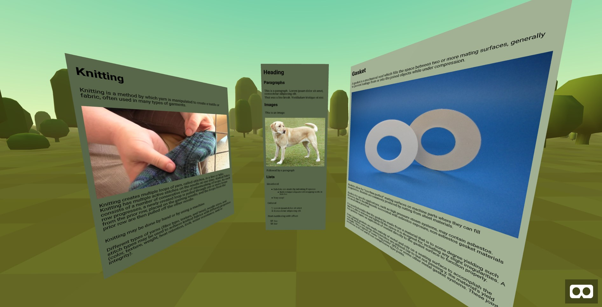

# aframe-markdown

[](https://www.npmjs.com/package/aframe-markdown)

Renders Markdown using SDF text in A-Frame.

Demos: https://brianpeiris.github.io/aframe-markdown/demos/

Glitch: https://aframe-markdown.glitch.me/



## Usage

```html
<a-scene 
  markdown="
    normalFont: https://unpkg.com/aframe-markdown/fonts/Roboto-msdf.json; 
    boldFont: https://unpkg.com/aframe-markdown/fonts/Roboto-Bold-msdf.json;
  "
>
  <a-assets>
	<a-asset-item id="md" src="test.md"></a-asset-item>
  </a-assets>
  <a-entity markdown="src: #md" position="0 1.5 -1"></a-entity>
</a-scene>
```

## Component Properties

|Properties|Description|Default|
|-|-|-|
|src|The source for the markdown to render. Either the actual markdown text, or a selector to an a-asset-item that loads the markdown||
|wrapCount|Number of characters before wrapping text (more or less).|40|
|padding|Padding in meters between the background and the text|0.05|

## System Properties

|Properties|Description|Default|
|-|-|-|
|normalFont|URL to the msdf.json file for the normal weight font||
|normalFont|URL to the msdf.json file for the bold font||

## Supported Markdown Features

aframe-markdown supports a basic subset of markdown.

- [x] Paragraphs
  - [x] Line breaks
- [x] Headers
- [x] Images
- [x] Lists
  - [x] Nested lists
  - [x] Unordered lists
  - [x] Ordered lists
- [ ] Inline bold and italic formatting
- [ ] Blockquotes
- [ ] Horizontal rules
- [ ] Tables
- [ ] Code
  - [ ] Inline code
  - [ ] Code blocks
- [ ] Links

## How it works

aframe-markdown uses a hidden div and marked.js to render the markdown in the background and then re-creates the 
rendered in a-frame using the HTML's metrics.
