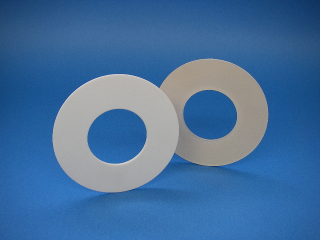

# Gasket

A gasket is a mechanical seal which fills the space between two or more mating surfaces, generally to prevent leakage from or into the joined objects while under compression.

Gaskets allow for "less-than-perfect" mating surfaces on machine parts where they can fill irregularities. Gaskets are commonly produced by cutting from sheet materials.

Gaskets for specific applications, such as high pressure steam systems, may contain asbestos. However, due to health hazards associated with asbestos exposure, non-asbestos gasket materials are used when practical.

It is usually desirable that the gasket be made from a material that is to some degree yielding such that it is able to deform and tightly fill the space it is designed for, including any slight irregularities. A few gaskets require an application of sealant directly to the gasket surface to function properly.

Some (piping) gaskets are made entirely of metal and rely on a seating surface to accomplish the seal; the metal's own spring characteristics are utilized (up to but not passing σy, the material's yield strength). This is typical of some "ring joints" (RTJ) or some other metal gasket systems. These joints are known as R-con and E-con compressive type joints. 
