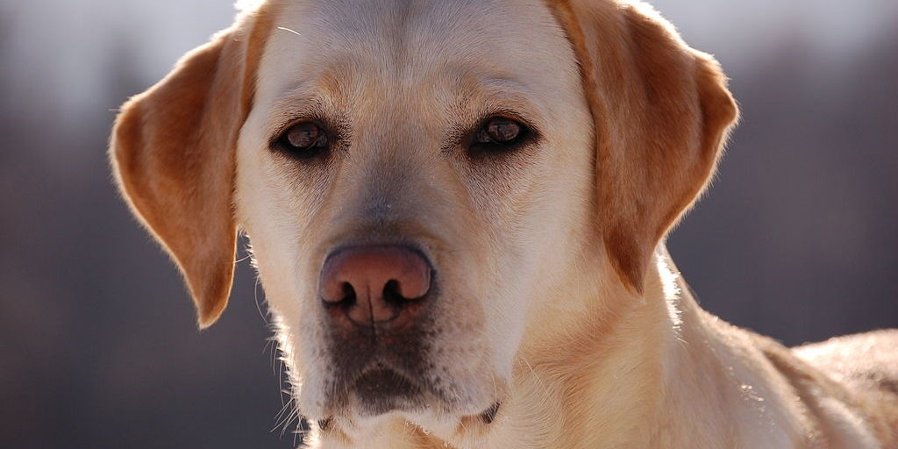

# Labradors

The Labrador Retriever, or just Labrador, is a type of retriever-gun dog. The Labrador is one of the most popular breeds of dog in Canada, the United Kingdom and the United States.

A favourite disability assistance breed in many countries, Labradors are frequently trained to aid the blind, those who have autism, to act as a therapy dog, or to perform screening and detection work for law enforcement and other official agencies. Additionally, they are prized as sporting and hunting dogs.

A few kennels breeding their ancestors, the St. John's water dog, were in England. At the same time, a combination of the sheep protection policy in Newfoundland and rabies quarantine in the United Kingdom, led to the gradual demise of the St. John's water dog in Canada.

In the 1830s, the 10th Earl of Home and his nephews the 5th Duke of Buccleuch and Lord John Scott, had imported progenitors of the breed from Newfoundland to Europe for use as gundogs. Another early advocate of these Newfoundland dogs, or Labrador Retrievers as they later became known, was the 2nd Earl of Malmesbury who bred them for their expertise in waterfowling.

During the 1880s, the 3rd Earl of Malmesbury, the 6th Duke of Buccleuch and the 12th Earl of Home collaborated to develop and establish the modern Labrador breed. The dogs Buccleuch Avon and Buccleuch Ned, given by Malmesbury to Buccleuch, were mated with female dogs carrying blood from those originally imported by the 5th Duke and the 10th Earl of Home. The offspring are considered to be the ancestors of modern Labradors. 
